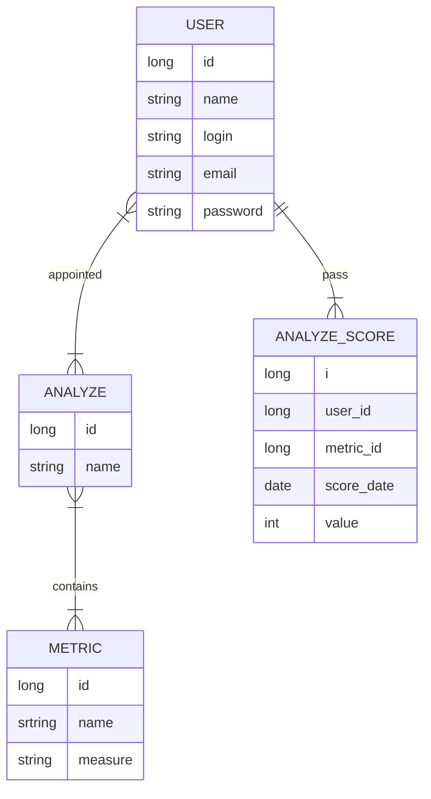

```mermaid
erDiagram
USER {
long id
string name
string login
string email
string password
}
ANALYZE {
long id
string name
}
METRIC {
long id
srtring name
string measure
}
ANALYZE_SCORE {
long i
long user_id
long metric_id
date score_date
int value
}

        USER }|--|{ ANALYZE : appointed
        ANALYZE  }|--|{ METRIC : contains
        USER ||--|{ ANALYZE_SCORE : pass
```
